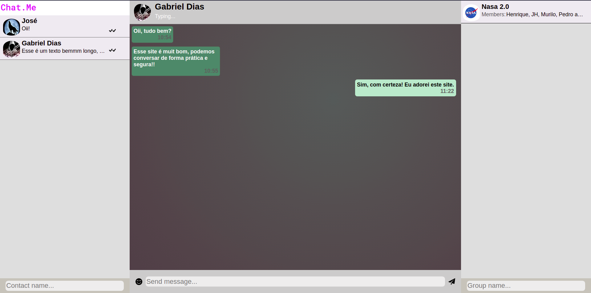
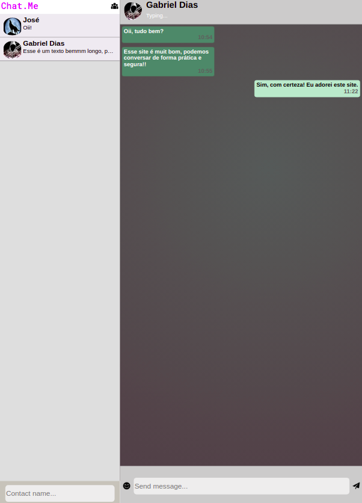
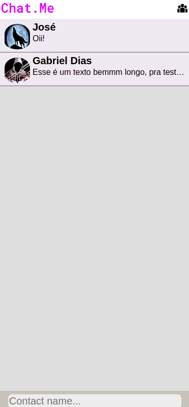

# CHAT.ME

Chat.Me simulates the basic interface of a traditional chat.
The project aims to practice using CSS and responsiveness concepts!

## HOW TO USE

* Download the repository and open chat-me.html.
* Access the preview available at: https://gabriel-dias-oliveira.github.io/chatme.html.

## PREVIEW

    </img> 

    </img> 

    </img> 

## ATTENTION

* The main objective of the project was to work with CSS and accountability. Issues such as system colors were not rigorously thought through.
* The site - currently - is strictly static, the JS application is a continuation of the project. :)
* It was a fun and fruitful experience, in addition to being fundamental for the continuity of my studies in the WEB area.
* Feel free to use the code and change it as you wish.
